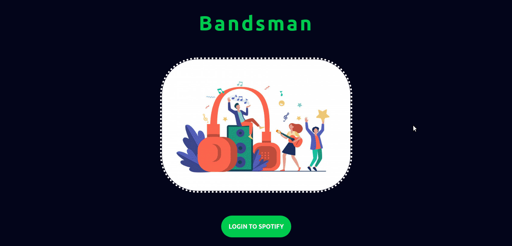

<h1 align='center'>BANDSMAN</h1>

#### Deployed Link - https://bandsman.netlify.app

### Description

Bandsman is a spotify client/clone. Once a user clicks **LOGIN TO SPOTIFY** on the home page, it takes the user to the Spotify Login page. After successfully logging in, this application fetches your playlist, your discover weekly and displays them all to the screen.
User can play any song on spotify with the account logged in and can see the same song playing in this application.

### Setting UP

Setting it up on the local system ->

1. Clone this repo. - `git clone https://github.com/pranjals149/Bandsman.git`
2. Move into the project directory - `cd Bandsman`
3. Install the Dependencies required - `npm install`
4. To run this application - `npm start`

**By default, it will run on the port 3000. URL - http://localhost:3000/**

### Working Screenshot

### Dependencies used

1. Material-UI
2. spotify-web-api-js
